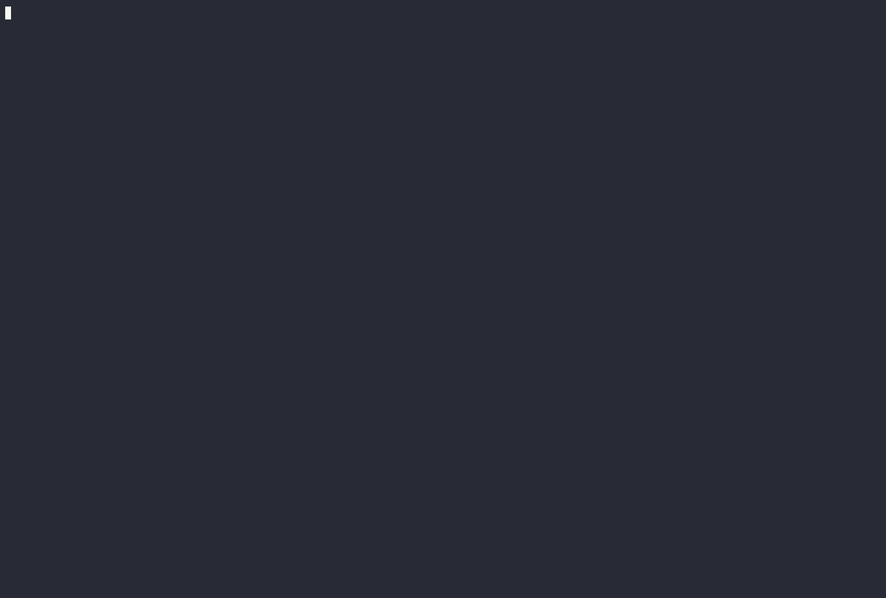

= Linear Command line interface
:toc: right
:toclevels: 3
:sectanchors:
:icons: font
:tip-caption: 💡
:note-caption: 📝
:experimental:

A command line interface to https://linear.app.

== Installation

=== I don't want to install

You can use the OCI container image to run the CLI without installing it.

[source,sh]
----
$ podman run -it --rm -e LINEAR_API_KEY=your-api-key ghcr.io/rubyists/linear-cli:stable lcls <1>
$ docker run -it --rm -e LINEAR_API_KEY=your-api-key ghcr.io/rubyists/linear-cli:stable lcls <2>
----
<1> Podman Usage
<2> Docker Usage

=== Gem install (Most should use this)

Requires ruby 3.2 or later

[source,sh]
----
$ gem install linear-cli
----

=== From Source (You are obviously a developer)

[source,sh]
----
$ git clone https://github.com/rubyists/linear-cli.git
$ cd linear-cli
$ bundle install
$ rake install
----

== Usage

=== Configuration

You must set the LINEAR_API_KEY environment variable to your Linear API key.
You can find your API key in your https://linear.app/settings/api[Linear Settings].

==== Tab Completion

If you are using bash or zsh, you can enable tab completion by adding the following to your `.bashrc` or `.zshrc`:

bash:

[source,sh]
----
eval "$(lc completion bash)"
----

zsh:

[source,sh]
----
eval "$(lc completion zsh)"
----

=== Commands

==== Help

You can get help/usage for any command or subcommand by using the `--help` flag.

[source,sh]
----
$ lc --help
$ lc [COMMAND] --help
$ lc [COMMAND] [SUBCOMMAND] --help
----

==== Who Am I?

You can use the 'w' alias for 'whoami'

[source,sh]
----
$ lc whoami
$ lc w --teams
----

==== List Issues

`lcls` is a helper provided to list issues. It's an alias for `lc issues list`.

[source,sh]
----
$ lcls
$ lcls --full
$ lcls -f CRY-1
----

==== Assign one or more issues to yourself (take em!)

'i' is a shortcut for the 'issue' command

[source,sh]
----
$ lc i take CRY-1234
$ lc issue take CRY-456 CRY-789
----

==== Create an issue

'c' is a shortcut for the 'create' subcommand of the issue command

[source,sh]
----
$ lc i c --title "My new issue" --description "This is a new issue" --labels Bug,Feature --team CRY
$ lc i c -t "My new issue" -T CRY -l Improvement,Feature
----

NOTE: If you don't provide a title, team, labels or description, you will be prompted to enter them.

==== Develop an issue

This will switch to the branch for the issue, creating the branch if it doesn't exist.

'dev' is a shortcut for the 'develop' subcommand of the issue command

[source,sh]
----
$ lc i dev CRY-1234
----

TIP: You may pass the --dev option to the create subcommand to immediately develop the created issue.

==== Update an issue

All of the update options can work on multiple issues, so long as it's not more than 50
at a time. You can also use the 'u' alias for 'update', and as always, the 'i' alias for 'issue'.

===== Add a comment to one or more issues

[source,sh]
----
$ lc issue update --comment "Here is a comment" CRY-1234 <1>
$ lc issue update --comment - CRY-14 CRY-15 <2>
$ lcomment CRY-1234 CRY-3 <3>
----
<1> This will use the provided comment
<2> This will prompt for a comment (use '-' to prompt)
<3> This will always prompt you for a comment ('lcomment' is an alias for 'lc issue update --comment -')

===== Close one or many issues

[source,sh]
----
$ lc i u --close --reason "These were closable" CRY-1234 CRY-2
----

=== Aliases

Some command aliases are available to make things easier to type.

[source,sh]
----
$ lcls
$ lcreate --description "This is a new issue" --labels Bug,Feature --team CRY
$ lclose --reason "This issue sucks" CRY-1234 CRY-456
$ lcancel --reason "These should never have been here" --trash CRY-1234 CRY-456
----
